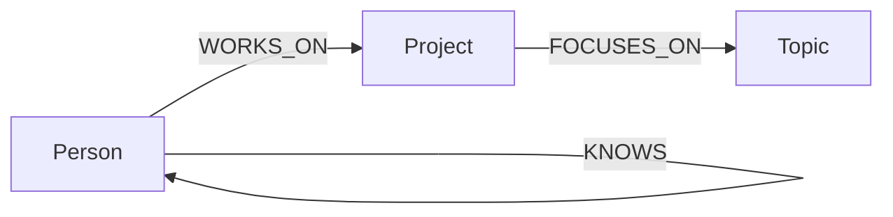

# Pathfinder — Graph-Powered Project Discovery

Pathfinder is a complete web application that helps people discover meaningful projects through the relationships between **projects, contributors, and topics**. Instead of treating discovery as a flat list, Pathfinder answers graph-native questions such as: “Which other projects are connected to this one through shared contributors?” and “Which people can bridge this project to a new topic?”

This repository contains the **frontend and backend together in one self-contained project folder**. It is designed to be straightforward to run locally, easy to explain in an interview, and ready to connect to a CognoDB Cloud instance.

## Project overview

The application was built for the CognoDB graph database assignment. The main experience is the Pathfinder Explorer homepage. A visitor can search projects, inspect project details, see the people connected to a project, and follow two-hop relationships to related projects. The interface includes responsive styling, graph-inspired visual elements, loading skeletons, empty states, API-powered search, database connection status, and a fallback demo mode.

The backend is implemented with **FastAPI**. The data layer uses the official **Neo4j Python driver**, because CognoDB supports the Neo4j driver and openCypher over Bolt. When valid CognoDB credentials are available, the application reads live graph data. When credentials are not configured or the database is unreachable, it safely displays included demo data so the interface remains usable during review.

> Pathfinder demonstrates that a graph database is valuable when the product’s main questions are about relationships, paths, neighborhoods, and shared connections rather than isolated records.

## Why this is a good graph use case

A conventional relational application would typically need several join tables to represent contributors, projects, topics, and their associations. Pathfinder’s central feature is a traversal across those relationships:

```text
Project <- WORKS_ON - Person - WORKS_ON -> Related Project
```

This two-hop traversal makes “find related projects through shared contributors” a natural graph query. The model is also easy to extend with new node types such as organizations or events and new relationship properties such as contribution dates, roles, or confidence scores.

## Architecture

The frontend and backend are intentionally consolidated in the same folder:

```text
cognodb-graph-explorer/
├── app/
│   ├── main.py                 # FastAPI application and routes
│   ├── config.py               # Environment-based configuration
│   ├── services/
│   │   └── graph.py            # CognoDB/Neo4j repository and demo fallback
│   ├── templates/
│   │   ├── index.html           # Main frontend: inline HTML, CSS, and JavaScript
│   │   └── project.html         # Project detail view
│   └── static/
│       └── styles.css           # Shared detail-page styles
├── cypher/
│   └── queries.cypher           # Documented graph queries
├── scripts/
│   └── seed.py                  # Idempotent CognoDB seed loader
├── tests/
│   └── test_app.py              # API and behavior tests
├── .env.example                 # Safe environment template
├── requirements.txt             # Python dependencies
├── pytest.ini                   # Test configuration
└── README.md                    # This documentation
```

The main frontend is deliberately contained in `app/templates/index.html`. Its responsive layout, visual styling, loading state, error state, empty state, and JavaScript search behavior are all in that one file. There is no React build process or separate frontend server to configure.

## Graph data model



The seed dataset contains four people, three projects, three topics, and relationships connecting them. The principal labels and relationships are summarized below.

| Element | Role in Pathfinder |
|---|---|
| `Person` | A contributor or collaborator connected to projects. |
| `Project` | A project a visitor can explore. |
| `Topic` | A subject area associated with a project. |
| `WORKS_ON` | Connects a person to a project and powers related-project discovery. |
| `FOCUSES_ON` | Connects a project to one or more topics. |
| `KNOWS` | Reserved for future person-to-person discovery. |

## Main graph queries

The application uses parameterized Cypher through the official driver. It does not concatenate user input into query strings.

The project detail query loads a project, its contributors, and its topics. The related-project query performs the required two-hop traversal:

```cypher
MATCH (source:Project {id: $project_id})<-[:WORKS_ON]-(person:Person)-[:WORKS_ON]->(related:Project)
WHERE source <> related
RETURN related, count(DISTINCT person) AS shared_people
ORDER BY shared_people DESC
```

The repository also includes a bridge-topic query that finds topics represented by connected projects but not yet associated with the selected project. This is an example of a relationship-heavy question that is more expressive in a graph model than in a collection of unrelated rows.

## Run the complete project locally

The following commands run both frontend and backend together from the repository root:

```bash
git clone <your-repository-url>
cd cognodb-graph-explorer
python -m venv .venv
source .venv/bin/activate
pip install -r requirements.txt
cp .env.example .env
uvicorn app.main:app --reload
```

Open [http://localhost:8000](http://localhost:8000). The interactive API documentation is available at [http://localhost:8000/docs](http://localhost:8000/docs).

## Connect CognoDB Cloud

Create a free instance at [console.cognodb.com](https://console.cognodb.com/signup). Copy the Bolt URI and password shown during setup, then update `.env`:

```env
COGNODB_URI=bolt+s://<instance-id>.databases.cognodb.cloud
COGNODB_USER=cognodb
COGNODB_PASSWORD=<your-password>
DEMO_MODE=false
```

Load the included graph data:

```bash
python scripts/seed.py
```

Restart the server. The status indicator on the homepage and the `/api/health` endpoint will show whether the live CognoDB connection is active.

## API endpoints

| Method | Endpoint | Description |
|---|---|---|
| `GET` | `/` | Render the explorer homepage. |
| `GET` | `/projects/{project_id}` | Render a project and its graph neighborhood. |
| `GET` | `/api/health` | Return live, fallback, or demo connection status. |
| `GET` | `/api/projects?q=climate` | Search projects using the graph repository. |
| `GET` | `/api/projects/{project_id}` | Return project details and two-hop connections as JSON. |
| `GET` | `/api/stats` | Return project, person, topic, and relationship counts. |

## Testing

Run the test suite from the same root folder:

```bash
pytest -q
```

The tests run without CognoDB credentials and cover health handling, search, project detail retrieval, two-hop connections, and missing-project errors.

## Deployment and submission

Deploy the repository to any Python-capable host. Use this start command:

```bash
uvicorn app.main:app --host 0.0.0.0 --port $PORT
```

Set the CognoDB environment variables in the hosting provider’s secret configuration, run `python scripts/seed.py` once, and keep the CognoDB instance active while the application is being reviewed. For the assignment submission, provide the GitHub repository URL, hosted demo URL, screenshots, and a short screen recording.

## Future improvements

The current version intentionally focuses on a small, complete, explainable experience. Strong follow-up features would include a visual neighborhood graph, contributor profile pages, topic-based recommendations, relationship metadata such as dates and roles, and authentication for teams maintaining their own project network.
# hh

